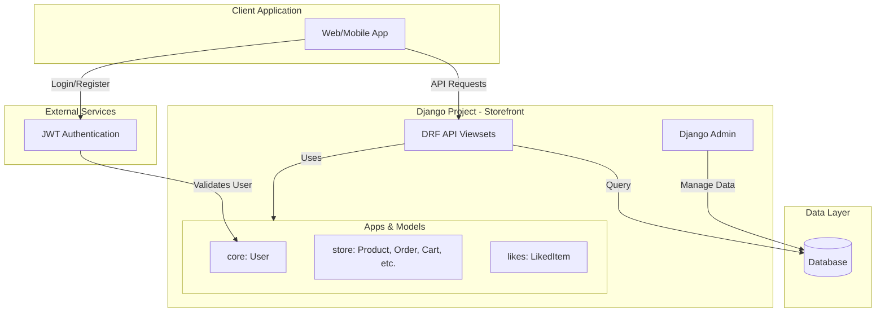
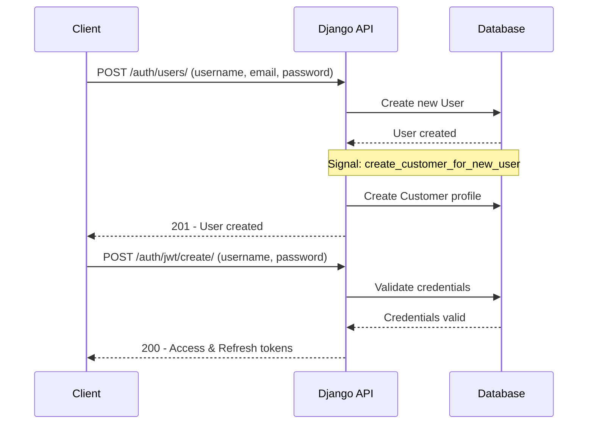
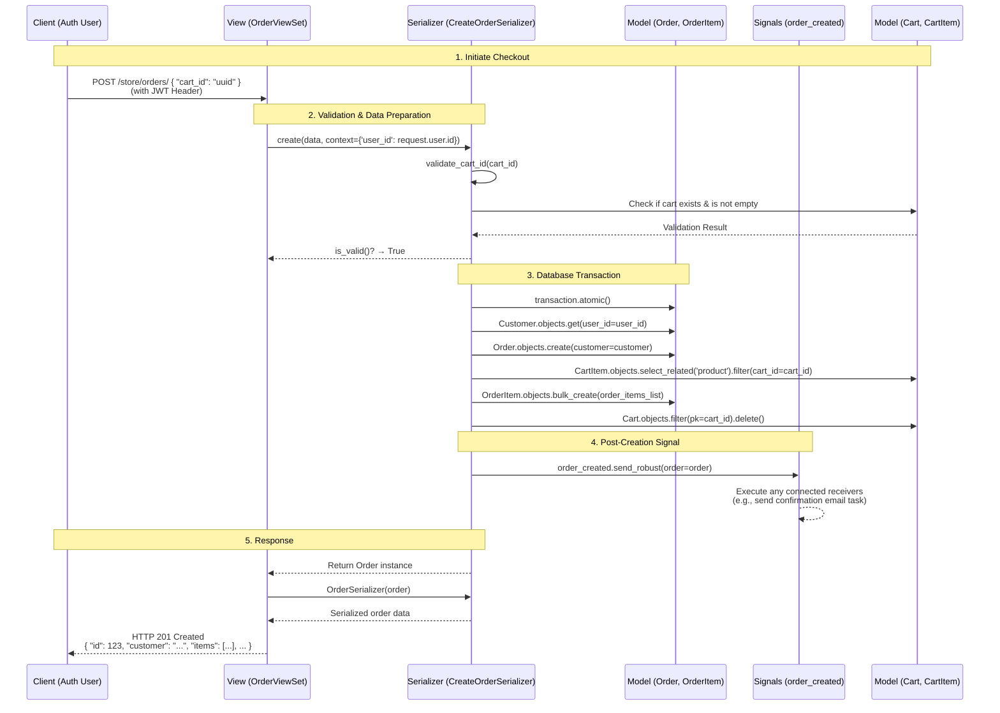
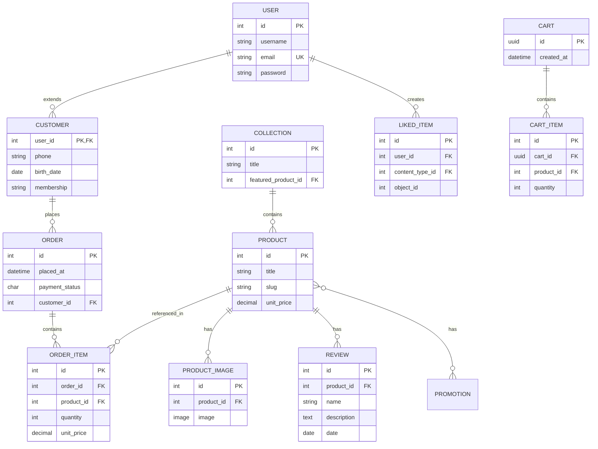
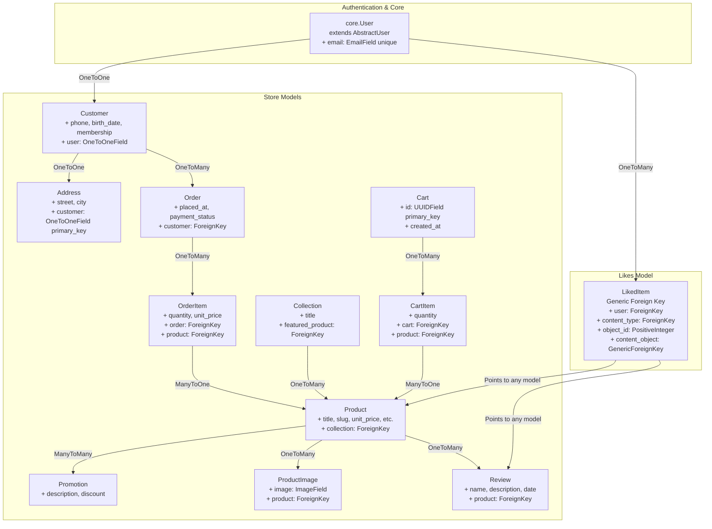

#  Django Storefront API

A robust, scalable, and feature-rich RESTful API backend for an e-commerce platform, built with Django and Django REST Framework (DRF). This project demonstrates modern API design patterns, including a decoupled architecture, JWT authentication, and efficient data modeling.

##  Features

- **JWT Authentication & Authorization**: Secure user registration and login using Djoser. Role-based permissions for customers and administrators.
- **Complete E-commerce Logic**: Full implementation of products, collections, shopping carts, orders, and customers.
- **Flexible Product Catalog**: Support for products with images, categories (collections), promotions, and customer reviews.
- **Generic Likes System**: A reusable "like" functionality that can be attached to any model (e.g., products, reviews) using Django's Content Types framework.
- **Optimized Performance**: Utilizes `select_related`, `prefetch_related`, and annotations to minimize database queries.
- **Advanced Filtering & Search**: Integrated with `django-filter` for field-level filtering and DRF's built-in search and ordering.
- **Admin Dashboard**: Customized Django admin interface for managing the entire platform.
- **Debugging Ready**: Pre-configured with Django Debug Toolbar for performance analysis.
---
## System Architecture & Data Model

The application is built with a clean, modular structure:

### Apps Overview
*   `core`: Custom user model extending `AbstractUser`.
*   `store`: Core e-commerce functionality (Products, Orders, Carts, etc.).
*   `likes`: Generic liking system using Django's ContentTypes.
---
### High-Level Architecture


---
##  API Endpoints

| Endpoint | Method | Description | Permission |
| :--- | :--- | :--- | :--- |
| `/auth/` | POST, etc | User registration & JWT token management | Public |
| `/store/products/` | GET | List all products (with filtering, search, ordering) | Public |
| `/store/products/` | POST | Create a new product | Admin Only |
| `/store/products/{id}/` | GET | Get product details | Public |
| `/store/carts/` | POST | Create a new cart | Public |
| `/store/carts/{uuid}/` | GET | Retrieve a cart with its items | Public |
| `/store/carts/{uuid}/items/` | POST | Add an item to the cart | Public |
| `/store/orders/` | POST | Create a new order from cart | Authenticated |
| `/store/orders/` | GET | List user's orders | Authenticated |
| `/store/products/{id}/reviews/` | POST | Create a review for a product | Authenticated |
| `/customers/me/` | GET, PUT | Retrieve or update customer profile | Authenticated |

*For a complete list of nested routes (e.g., `/store/products/{id}/reviews/`), check the `store/urls.py` file.*

---
## 🛠️ Installation & Setup

### Prerequisites
- Python 3.10+
- PostgreSQL
- pip

### Steps
1.  **Clone the repository**
    ```bash
    git clone https://github.com/your-username/django-storefront-api.git
    cd django-storefront-api
    ```

2.  **Create a virtual environment and activate it**
    ```bash
    python -m venv venv
    source venv/bin/activate  # On Windows: venv\Scripts\activate
    ```

3.  **Install dependencies**
    ```bash
    pip install -r requirements.txt
    ```

4.  **Run migrations**
    ```bash
    python manage.py migrate
    ```

5.  **Create a superuser**
    ```bash
    python manage.py createsuperuser
    ```

6.  **Run the development server**
    ```bash
    python manage.py runserver
    ```
    The API will be available at `http://localhost:8000/`. The Django admin site is at `http://localhost:8000/admin/`.
---
## 📁 Project Structure

```
django-storefront-api/
├── core/                         # Custom user model app
│   ├── models.py
│   ├── serializers.py
│   └── signals.py
├── likes/                        # Generic likes app
│   └── models.py
├── store/                        # Main e-commerce app
│   ├── models.py
│   ├── serializers.py
│   ├── views.py
│   ├── urls.py
│   ├── permissions.py
│   └── signals.py
├── storefront/                   # Project settings
│   ├── settings.py
│   ├── urls.py
│   └── asgi.py
└── requirements.txt
```
---
## Key Workflows

### User Registration & Authentication Flow


---
### Complete Purchase Sequence


---
## Data Model (ERD)

This diagram illustrates the core relationships between the main models in the application:


---
### Models Flowchart


---
## Testing the API

Use a tool like **Postman** or **Thunder Client (VSCode)** to test the endpoints.

1.  **Register a User:**
    `POST /auth/users/`
    ```json
    {
      "username": "johndoe",
      "password": "securepassword123",
      "email": "john@example.com"
    }
    ```

2.  **Get JWT Tokens:**
    `POST /auth/jwt/create/`
    ```json
    {
      "username": "johndoe",
      "password": "securepassword123"
    }
    ```
    Use the returned `access` token in the `Authorization: Bearer <token>` header for subsequent requests.

3.  **Create an Order:**
    `POST /store/orders/`
    ```json
    {
      "cart_id": "a1b2c3d4-1234-5678-9abc-abcdef123456"
    }
    ```
---
## Contributing

Contributions are welcome! Please feel free to submit a Pull Request.

1.  Fork the project.
2.  Create your feature branch (`git checkout -b feature/AmazingFeature`).
3.  Commit your changes (`git commit -m 'Add some AmazingFeature'`).
4.  Push to the branch (`git push origin feature/AmazingFeature`).
5.  Open a Pull Request.

---

## Acknowledgments

- Built with [Django](https://www.djangoproject.com/) and [Django REST Framework](https://www.django-rest-framework.org/).
- Authentication powered by [Djoser](https://djoser.readthedocs.io/).
- Nested routing simplified with [DRF Nested Routers](https://github.com/alanjds/drf-nested-routers).
